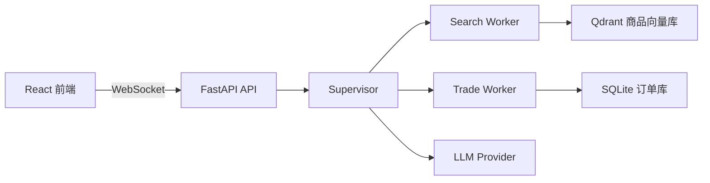

# ShopFlow

> 基于 FastAPI 与 AgentScope 构建的跨境电商智能导购 Agent MVP。

ShopFlow 将商品检索、预算与目的地约束、价格估算、订单确认和多轮对话串联为一条可追踪的购物闭环。

项目采用 **Supervisor–Workers 多智能体架构**，结合 RAG、Tool Calling、WebSocket 流式交互和状态化订单流程，实现从用户咨询到订单确认的完整演示链路。

## 功能特性

- **自然语言购物咨询**：识别用户的商品、预算、目的地和购买意图。
- **多智能体协作**：由 Supervisor 负责任务拆分与调度，Search Worker 负责商品检索，Trade Worker 负责价格估算与订单处理。
- **RAG 商品检索**：使用 Embedding 将商品数据向量化写入 Qdrant，结合语义召回与结构化排序提升匹配效果。
- **业务工具调用**：支持商品搜索、价格估算、下单和取消订单等工具。
- **可追踪订单流程**：使用 SQLite 持久化订单数据，并通过 `DRAFT → CONFIRMED → CANCELLED` 状态流转保证流程可追踪。
- **WebSocket 流式交互**：实时输出工具调用、工具结果、Token 增量和最终回复。
- **多轮会话记忆**：支持上下文延续，并具备并行任务调度、异常重试和降级机制。
- **前后端分离**：提供 React + TypeScript 前端页面，展示完整的 Agent 对话过程。

## 系统架构



## 技术栈

- **Backend**：Python 3.11+、FastAPI、Uvicorn、AgentScope 2.x、Pydantic
- **Agent**：Supervisor–Workers、Tool Calling、RAG、会话记忆
- **Storage**：SQLite、Qdrant
- **Frontend**：React 18、TypeScript、Vite
- **Communication**：RESTful API、WebSocket
- **Testing**：pytest、前端 TypeScript 检查与生产构建
- **DevOps**：uv、Docker Compose

## 本地运行

### 1. 准备后端环境

```bash
uv sync
```

按需复制环境变量模板并填写模型服务配置：

```bash
cp .env.example .env
```

需要配置时，至少关注以下变量：

```dotenv
LLM_BASE_URL=<OpenAI 兼容网关地址>
LLM_API_KEY=<模型服务密钥>
LLM_MODEL=<模型名称>
```

`.env` 已被 Git 忽略，请勿提交真实密钥。

### 2. 启动后端

```bash
uv run uvicorn app.presentation.server:app --host 0.0.0.0 --port 8000
```

### 3. 启动前端

```bash
cd frontend
npm ci
npm run dev
```

启动后，可通过前端页面进行商品咨询、价格估算和订单流程演示。

## API 概览

- `POST /commerce/intents`：提交买家自然语言意图
- `WS /commerce/events`：订阅会话事件流
- `GET /commerce/orders/{order_id}`：查询订单
- `POST /commerce/orders/{order_id}/cancel`：取消订单
- `GET /health`：健康检查

## 项目结构

```text
app/
├── application/       # 应用服务、Agent 编排、Prompt 与用例
├── domain/            # 商品、订单等领域模型
├── infrastructure/    # RAG、存储、缓存和外部适配器
└── presentation/      # FastAPI 与 WebSocket 接口

frontend/              # React 前端
knowledge/             # 商品与业务知识
eval/                  # 评测用例集
docs/                  # 设计演进记录
docker/                # Docker Compose 配置
scripts/               # 开发、冒烟与评测脚本
tests/                 # 自动化测试
```

## 验证

运行后端测试：

```bash
uv run pytest
```

运行前端生产构建：

```bash
cd frontend
npm run build
```

还可以使用以下脚本验证端到端链路和并行调度：

```bash
uv run python scripts/smoke_e2e.py
uv run python scripts/verify_parallel.py
uv run python scripts/eval_regression.py
```

## Docker 运行

```bash
docker compose -f docker/docker-compose.yaml up -d --build
```

- 前端：`http://localhost:5173`
- 后端：`http://localhost:8000`

## 项目边界

当前项目定位为个人技术实践和 Agent MVP，默认使用本地样例商品数据及可配置的模型/服务适配器。

项目目前不等同于真实生产电商平台，尚未覆盖真实商户库存、支付、物流、供应链和多实例生产部署等能力。
